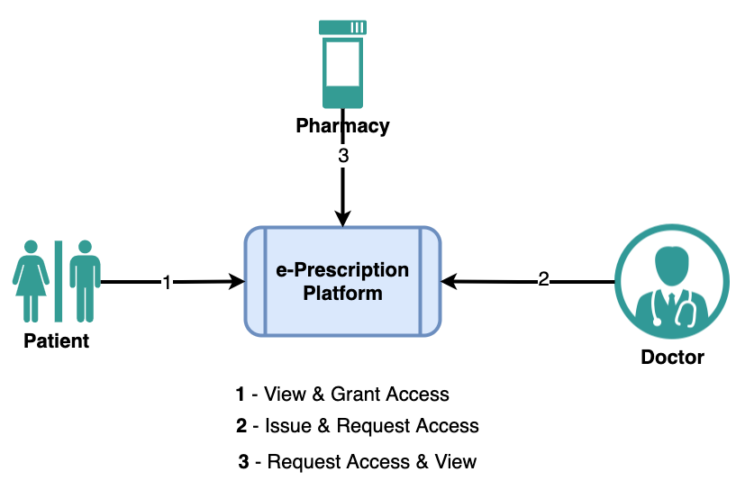

# A Billion User App -ePrescription

A simple digital e-Prescription platform which can be used by 3 key parties Patient, Doctor & Pharmacy.
This platform can support billion users.  

Could be a usefull model for countries like India where electronic prescription is not available yet for everyone.

Doctor - issues prescription

Patient - accesses prescription

Pharmacy - accesses prescription

