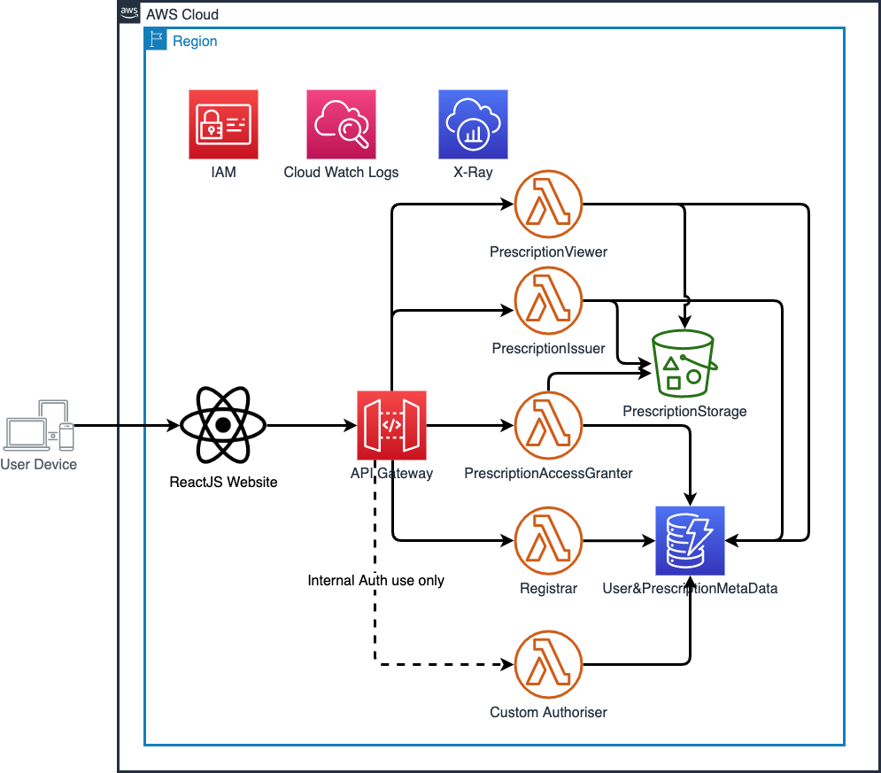
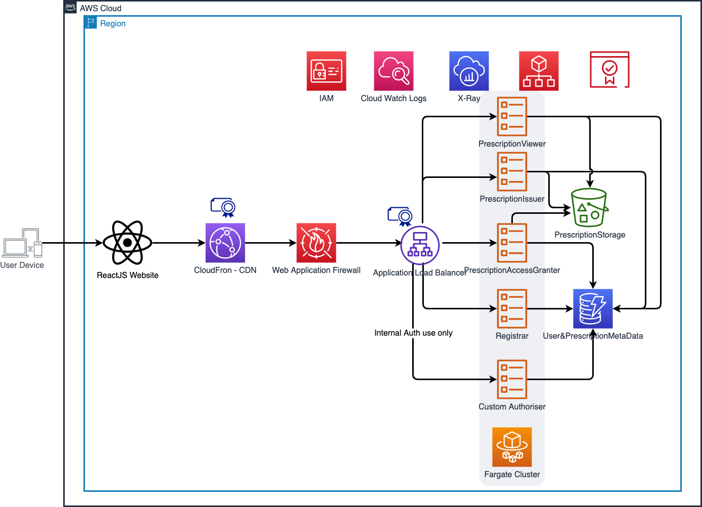

# backend-app
## Serverless Architecture

1. Serverless Function (AWS Lambda) Based
- Pros
    - bla
    - bla
- Cons
    - High Cost when request vloumns are 1000 per seconds?
    - bla

2. Serverless Container (AWS Fargate) Based
- Pros
    - Low Cost when request vloumns are 1000 per seconds?
    - bla
- Cons
    - bla
    - bla

